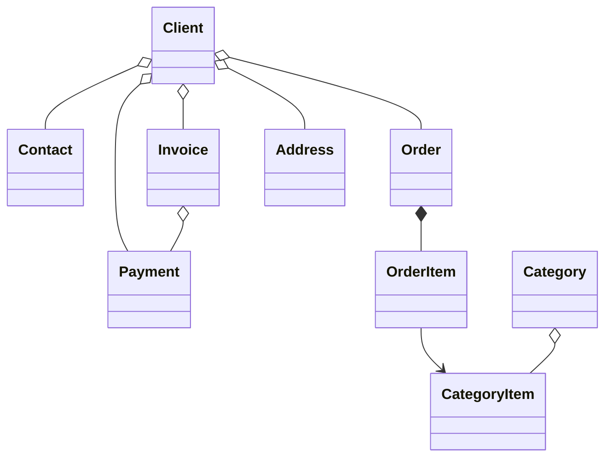

#  B2B CRM

Languages: [English](README.md) | [Русский](README_ru.md) | [Deutsch](README_de.md) | [Italiano](README_it.md) | [Español](README_es.md)

`B2B CRM` is an enterprise demo application built with Jmix that showcases how to develop **production-ready** business systems
including `customers`, `orders`, `invoicing`, `finance` and `analytics`. <br>It reflects real **ERP/CRM** scenarios and demonstrates 
best practices in domain modeling, UI, security, and business logic implementation.

## 📑 Table of Contents

- [Overview](#-overview)
- [Technical stack](#-technical-stack)
- [Add-ons in use](#-add-ons)
- [Build and run](#-build-and-run)
- [AI Assistant](#-ai-assistant)
- [Demo data](#-demo-data)
- [Accounts](#-application-accounts)
- [Domain Model](#-domain-model)
- [Role Model](#-role-model)

## 📖 Overview

This project models a typical B2B sales workflow:

- Manage the catalog of your products and categories
- Maintain clients and contacts
- Track orders and order items
- Issue invoices and record payments
- Ask an AI assistant for business insights
- Monitor tasks and recent activities
- See sales analytics

## 🛠️ Technical Stack

- Java 21
- Jmix 2.7
- Spring Boot 3
- HSQLDB

## 🧩 Add-ons

- Audit
- Application settings
- Charts
- Data tools
- Dynamic attributes
- Grid export
- Local file storage
- Reports (includes an invoice template)

## 🚀 Build and Run

Prerequisites: Java 21+

### Run Project

1. Run [B2B CRM](.run/crm-app.run.xml) Jmix run configuration or execute

   ```bash
   ./gradlew bootRun
   ```

2. [Open application URL](http://localhost:8080/b2b-crm)

### Run via JAR:

```bash
./gradlew bootJar -Pvaadin.productionMode
```

```bash
java -jar build/libs/crm.jar
```

### Run via Docker

```bash
docker build -t jmix-crm .
```

```bash
docker run --rm -p 8080:8080 jmix-crm
```

### Run via Docker Compose

```bash
docker-compose up
```

## 🤖 AI Assistant

The application includes a built-in `CRM AI` workspace for natural-language analysis of CRM data.

Key capabilities:

- Ask business questions about clients, orders, invoices, payments, and sales performance
- Respect the current user's data access permissions and keep conversations private to their author
- Use built-in business reports such as `Client 360 Report` and `Category Cashflow Risk Allocation Report`
- Keep the conversation history with automatically generated chat titles
- Upload files to the conversation and let the assistant analyze supported documents and images
- Generate interactive links to CRM records directly in responses

Configuration:

- Set `spring.ai.openai.api-key` in [application.properties](src/main/resources/application.properties) or provide the `SPRING_AI_OPENAI_APIKEY` environment variable

When enabled, open the `CRM AI` item in the main menu to start a new conversation.

## 🎲 Demo Data

The local profile generates demo data on the application start:

- You can disable demo data generation with `crm.generateDemoData` property
  in [application.properties](src/main/resources/application.properties)
- Catalog imported from [catalog.xlsx](src/main/resources/demo-data/catalog.xlsx)

## 👥 Application Accounts

| Position        | Username      | Password | Access                                         |
|-----------------|---------------|----------|------------------------------------------------|
| Administrator   | ```admin```   | admin    | Full access to all data and settings           |
| Supervisor      | ```james```   | james    | Manager + catalog management + assign accounts |
| Manager         | ```manager``` | manager  | Full access to all clients and orders          |
| Account Manager | ```alice```   | alice    | Only sees clients assigned to Alice Brown      |
| Account Manager | ```robert```  | robert   | Only sees clients assigned to Robert Taylor    |

## ⚙️ Domain Model



## 🔐 Role Model

The application uses a hierarchical role model:

- `Administrator`: Full access to all application features, entities, and settings.
- `Supervisor`: Extends the Manager role with additional administrative capabilities:
    - Manage product catalog (Categories and Category Items).
    - Assign Account Managers to Clients.
- `Manager`: Primary role for sales operations.
    - Full access to Clients, Contacts, Orders, Invoices, and Payments.
    - Read-only access to the product catalog.
    - Manage own Tasks.
- `UI Minimal`: Minimal access, allowing login and basic navigation.
