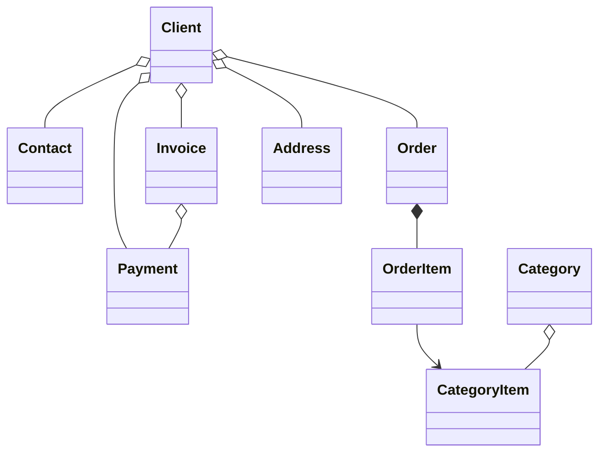

#  B2B CRM

Sprachen: [English](README.md) | [Русский](README_ru.md) | [Deutsch](README_de.md) | [Italiano](README_it.md) | [Español](README_es.md)

`B2B CRM` ist eine Enterprise-Demoanwendung auf Basis von Jmix, die zeigt, wie **produktionsreife** Geschäftssysteme
für `Kunden`, `Aufträge`, `Rechnungsstellung`, `Finanzen` und `Analysen` entwickelt werden. <br>Sie bildet reale **ERP/CRM**-Szenarien ab und demonstriert
Best Practices für Domänenmodellierung, UI, Sicherheit und die Implementierung von Geschäftslogik.

## 📑 Inhaltsverzeichnis

- [Überblick](#-überblick)
- [Technischer Stack](#-technischer-stack)
- [Verwendete Add-ons](#-verwendete-add-ons)
- [Build und Start](#-build-und-start)
- [AI-Assistent](#-ai-assistent)
- [Demo-Daten](#-demo-daten)
- [Konten](#-anwendungskonten)
- [Domänenmodell](#-domänenmodell)
- [Rollenmodell](#-rollenmodell)

## 📖 Überblick

Dieses Projekt modelliert einen typischen B2B-Vertriebsablauf:

- Produkt- und Kategorienkatalog verwalten
- Kunden und Kontakte pflegen
- Aufträge und Auftragspositionen nachverfolgen
- Rechnungen ausstellen und Zahlungen erfassen
- Einen AI-Assistenten nach geschäftlichen Erkenntnissen fragen
- Aufgaben und letzte Aktivitäten überwachen
- Vertriebsanalysen anzeigen

## 🛠️ Technischer Stack

- Java 21
- Jmix 2.8
- Spring Boot 3
- HSQLDB

## 🧩 Verwendete Add-ons

- Audit
- Application settings
- Charts
- Data tools
- Dynamic attributes
- Grid export
- Local file storage
- Reports, einschließlich einer Rechnungsvorlage

## 🚀 Build und Start

Voraussetzungen: Java 21+

### Projekt starten

1. Starte die Jmix-Run-Konfiguration [B2B CRM](.run/crm-app.run.xml) oder führe aus

   ```bash
   ./gradlew bootRun
   ```

2. [Anwendungs-URL öffnen](http://localhost:8080/b2b-crm)

### Start per JAR

```bash
./gradlew bootJar -Pvaadin.productionMode
```

```bash
java -jar build/libs/crm.jar
```

### Start per Docker

```bash
docker build -t jmix-crm .
```

```bash
docker run --rm -p 8080:8080 jmix-crm
```

### Start per Docker Compose

```bash
docker-compose up
```

## 🤖 AI-Assistent

Die Anwendung enthält einen integrierten `CRM AI`-Arbeitsbereich für die natürlichsprachliche Analyse von CRM-Daten.

Wichtige Funktionen:

- Geschäftsfragen zu Kunden, Aufträgen, Rechnungen, Zahlungen und Vertriebsleistung stellen
- Die Datenzugriffsrechte des aktuellen Benutzers berücksichtigen und Konversationen nur für ihren Autor sichtbar halten
- Integrierte Geschäftsberichte wie `Client 360 Report` und `Category Cashflow Risk Allocation Report` verwenden
- Den Konversationsverlauf mit automatisch generierten Chat-Titeln speichern
- Dateien in die Konversation hochladen und den Assistenten unterstützte Dokumente und Bilder analysieren lassen
- Interaktive Links zu CRM-Datensätzen direkt in Antworten generieren

Konfiguration:

- Setze `spring.ai.openai.api-key` in [application.properties](src/main/resources/application.properties) oder stelle die Umgebungsvariable `SPRING_AI_OPENAI_APIKEY` bereit

Nach der Aktivierung öffne den Menüpunkt `CRM AI` im Hauptmenü, um eine neue Konversation zu starten.

## 🎲 Demo-Daten

Das lokale Profil generiert Demo-Daten beim Start der Anwendung:

- Die Generierung von Demo-Daten kann mit der Eigenschaft `crm.generateDemoData`
  in [application.properties](src/main/resources/application.properties) deaktiviert werden
- Der Katalog wird aus [catalog.xlsx](src/main/resources/demo-data/catalog.xlsx) importiert

## 👥 Anwendungskonten

| Position        | Benutzername  | Passwort | Zugriff                                         |
|-----------------|---------------|----------|-------------------------------------------------|
| Administrator   | ```admin```   | admin    | Vollzugriff auf alle Daten und Einstellungen    |
| Supervisor      | ```james```   | james    | Manager + Katalogverwaltung + Konten zuweisen   |
| Manager         | ```manager``` | manager  | Vollzugriff auf alle Kunden und Aufträge        |
| Account Manager | ```alice```   | alice    | Sieht nur Kunden, die Alice Brown zugewiesen sind |
| Account Manager | ```robert```  | robert   | Sieht nur Kunden, die Robert Taylor zugewiesen sind |

## ⚙️ Domänenmodell



## 🔐 Rollenmodell

Die Anwendung verwendet ein hierarchisches Rollenmodell:

- `Administrator`: Vollzugriff auf alle Anwendungsfunktionen, Entitäten und Einstellungen.
- `Supervisor`: Erweitert die Manager-Rolle um zusätzliche administrative Funktionen:
    - Produktkatalog verwalten, einschließlich Categories und Category Items.
    - Account Managers Kunden zuweisen.
- `Manager`: Primäre Rolle für Vertriebsprozesse.
    - Vollzugriff auf Clients, Contacts, Orders, Invoices und Payments.
    - Lesezugriff auf den Produktkatalog.
    - Eigene Tasks verwalten.
- `UI Minimal`: Minimaler Zugriff, der Anmeldung und grundlegende Navigation ermöglicht.
