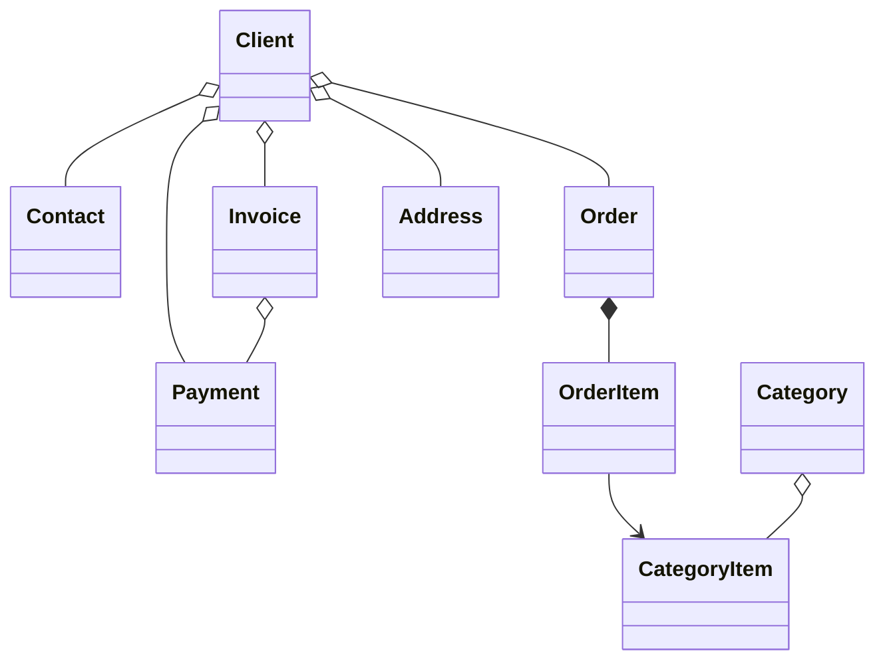

#  B2B CRM

Idiomas: [English](README.md) | [Русский](README_ru.md) | [Deutsch](README_de.md) | [Italiano](README_it.md) | [Español](README_es.md)

`B2B CRM` es una demo de aplicación empresarial creada con Jmix que muestra cómo desarrollar sistemas de negocio **listos para su puesta en producción**
para `clientes`, `pedidos`, `facturación`, `finanzas` y `analítica`. <br>Refleja escenarios reales **ERP/CRM** y demuestra
buenas prácticas de modelado de dominio, UI, seguridad e implementación de lógica de negocio.

## 📑 Índice

- [Resumen](#-resumen)
- [Stack técnológico](#-stack-técnico)
- [Add-ons utilizados](#-add-ons-utilizados)
- [Build y ejecución](#-build-y-ejecución)
- [Asistente de IA](#-asistente-de-ia)
- [Datos demo](#-datos-demo)
- [Cuentas](#-cuentas-de-la-aplicación)
- [Modelo de dominio](#-modelo-de-dominio)
- [Modelo de roles](#-modelo-de-roles)

## 📖 Resumen

Este proyecto modela un flujo típico de ventas B2B para:

- gestionar el catálogo de productos y categorías
- mantener clientes y contactos
- hacer seguimiento de pedidos y líneas de pedido
- emitir facturas y registrar pagos
- preguntar a un asistente de IA por perspectivas de negocio
- supervisar tareas y actividades recientes
- ver analítica de ventas

## 🛠️ Stack técnológico

- Java 21
- Jmix 2.7
- Spring Boot 3
- HSQLDB

## 🧩 Add-ons utilizados

- Audit
- Application settings
- Charts
- Data tools
- Dynamic attributes
- Grid export
- Local file storage
- Reports, incluida una plantilla de factura

## 🚀 Build y ejecución

Requisitos: Java 21+

### Para ejecutar el proyecto

1. Ejecuta la configuración Jmix [B2B CRM](.run/crm-app.run.xml) o ejecuta

   ```bash
   ./gradlew bootRun
   ```

2. [Abre la URL de la aplicación](http://localhost:8080/b2b-crm)

### Ejecutar mediante JAR

```bash
./gradlew bootJar -Pvaadin.productionMode
```

```bash
java -jar build/libs/crm.jar
```

### Ejecutar mediante Docker

```bash
docker build -t jmix-crm .
```

```bash
docker run --rm -p 8080:8080 jmix-crm
```

### Ejecutar mediante Docker Compose

```bash
docker-compose up
```

## 🤖 Asistente de IA

La aplicación incluye un espacio de trabajo integrado `CRM AI` para el análisis de datos CRM en lenguaje natural.

Capacidades principales:

- Hacer preguntas de negocio sobre clientes, pedidos, facturas, pagos y rendimiento de ventas
- Respetar los permisos de acceso a datos del usuario actual y mantener las conversaciones privadas para su autor
- Usar informes de negocio integrados como `Client 360 Report` y `Category Cashflow Risk Allocation Report`
- Mantener el historial de conversación con títulos de chat generados automáticamente
- Subir archivos a la conversación y permitir que el asistente analice documentos e imágenes compatibles
- Generar enlaces interactivos a registros CRM directamente en las respuestas

Configuración:

- Define `spring.ai.openai.api-key` en [application.properties](src/main/resources/application.properties) o proporciona la variable de entorno `SPRING_AI_OPENAI_APIKEY`

Cuando esté habilitado, abre el elemento `CRM AI` en el menú principal para iniciar una nueva conversación.

## 🎲 Datos demo

El perfil local genera datos demo al iniciar la aplicación:

- Puedes desactivar la generación de datos demo con la propiedad `crm.generateDemoData`
  en [application.properties](src/main/resources/application.properties)
- El catálogo se importa desde [catalog.xlsx](src/main/resources/demo-data/catalog.xlsx)

## 👥 Cuentas de la aplicación

| Puesto                                    | Usuario   | Contraseña | Acceso                                                |
| ----------------------------------------- | --------- | ---------- | ----------------------------------------------------- |
| Administrador del sistema (Administrator) | `admin`   | admin      | Acceso completo a todos los datos y configuraciones   |
| Supervisor                                | `james`   | james      | Manager + gestión de catálogo + asignación de cuentas |
| Manager                                   | `manager` | manager    | Acceso completo a todos los clientes y pedidos        |
| Gestora de cuenta (Account Manager)       | `alice`   | alice      | Solo ve clientes asignados a Alice Brown              |
| Gestor de cuenta (Account Manager)        | `robert`  | robert     | Solo ve clientes asignados a Robert Taylor            |

## ⚙️ Modelo de dominio



## 🔐 Modelo de roles

La aplicación usa un modelo jerárquico de roles:

- `Administrator`: acceso completo a todas las funciones, entidades y configuraciones de la aplicación.
- `Supervisor`: como el rol Manager (ver más abajo), pero con capacidades administrativas adicionales:
  - Gestiona el catálogo de productos, incluidas Categories y Category Items.
  - Asigna Account Managers a Clients.
- `Manager`: rol principal para operaciones de ventas.
  - Acceso completo a Clients, Contacts, Orders, Invoices y Payments.
  - Acceso de solo lectura al catálogo de productos.
  - Gestión de sus propias Tasks.
- `UI Minimal`: acceso mínimo que permite iniciar sesión y navegación básica.
