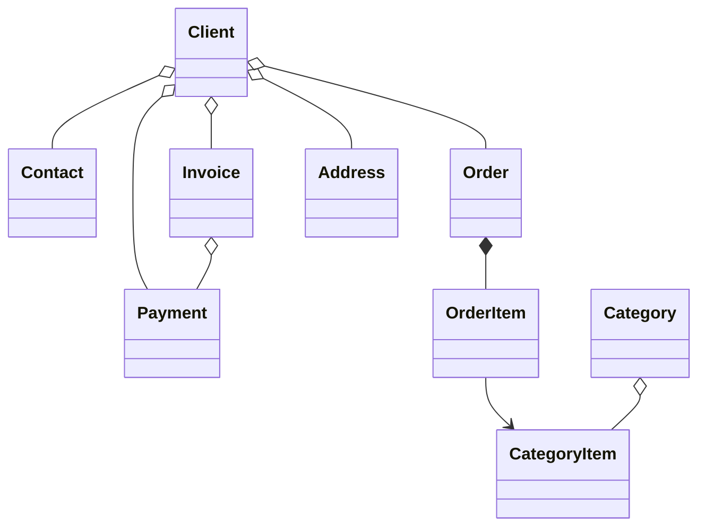

#  B2B CRM

Lingue: [English](README.md) | [Русский](README_ru.md) | [Deutsch](README_de.md) | [Italiano](README_it.md) | [Español](README_es.md)

`B2B CRM` è un'applicazione demo enterprise sviluppata con Jmix che mostra come creare sistemi aziendali **pronti per la produzione**
per `clienti`, `ordini`, `fatturazione`, `finanza` e `analisi`. <br>Rappresenta scenari reali **ERP/CRM** e dimostra
le best practice di modellazione del dominio, UI, sicurezza e implementazione della logica di business.

## 📑 Indice

- [Panoramica](#-panoramica)
- [Stack tecnico](#-stack-tecnico)
- [Add-on utilizzati](#-add-on-utilizzati)
- [Build ed esecuzione](#-build-ed-esecuzione)
- [Assistente AI](#-assistente-ai)
- [Dati demo](#-dati-demo)
- [Account](#-account-dellapplicazione)
- [Modello di dominio](#-modello-di-dominio)
- [Modello dei ruoli](#-modello-dei-ruoli)

## 📖 Panoramica

Questo progetto modella un tipico flusso di vendita B2B:

- Gestire il catalogo di prodotti e categorie
- Mantenere clienti e contatti
- Tracciare ordini e righe d'ordine
- Emettere fatture e registrare pagamenti
- Chiedere insight di business a un assistente AI
- Monitorare attività e attività recenti
- Visualizzare l'analisi delle vendite

## 🛠️ Stack tecnico

- Java 21
- Jmix 2.7
- Spring Boot 3
- HSQLDB

## 🧩 Add-on utilizzati

- Audit
- Application settings
- Charts
- Data tools
- Dynamic attributes
- Grid export
- Local file storage
- Reports, incluso un modello di fattura

## 🚀 Build ed esecuzione

Prerequisiti: Java 21+

### Esecuzione del progetto

1. Avvia la configurazione Jmix [B2B CRM](.run/crm-app.run.xml) oppure esegui

   ```bash
   ./gradlew bootRun
   ```

2. [Apri l'URL dell'applicazione](http://localhost:8080/b2b-crm)

### Esecuzione tramite JAR

```bash
./gradlew bootJar -Pvaadin.productionMode
```

```bash
java -jar build/libs/crm.jar
```

### Esecuzione tramite Docker

```bash
docker build -t jmix-crm .
```

```bash
docker run --rm -p 8080:8080 jmix-crm
```

### Esecuzione tramite Docker Compose

```bash
docker-compose up
```

## 🤖 Assistente AI

L'applicazione include uno spazio di lavoro integrato `CRM AI` per l'analisi in linguaggio naturale dei dati CRM.

Funzionalità principali:

- Porre domande di business su clienti, ordini, fatture, pagamenti e performance di vendita
- Rispettare le autorizzazioni di accesso ai dati dell'utente corrente e mantenere le conversazioni private per il loro autore
- Usare report aziendali integrati come `Client 360 Report` e `Category Cashflow Risk Allocation Report`
- Conservare la cronologia delle conversazioni con titoli chat generati automaticamente
- Caricare file nella conversazione e lasciare che l'assistente analizzi documenti e immagini supportati
- Generare link interattivi ai record CRM direttamente nelle risposte

Configurazione:

- Imposta `spring.ai.openai.api-key` in [application.properties](src/main/resources/application.properties) oppure fornisci la variabile d'ambiente `SPRING_AI_OPENAI_APIKEY`

Quando è abilitato, apri la voce `CRM AI` nel menu principale per iniziare una nuova conversazione.

## 🎲 Dati demo

Il profilo locale genera dati demo all'avvio dell'applicazione:

- Puoi disabilitare la generazione dei dati demo con la proprietà `crm.generateDemoData`
  in [application.properties](src/main/resources/application.properties)
- Il catalogo viene importato da [catalog.xlsx](src/main/resources/demo-data/catalog.xlsx)

## 👥 Account dell'applicazione

| Posizione       | Nome utente   | Password | Accesso                                          |
|-----------------|---------------|----------|--------------------------------------------------|
| Administrator   | ```admin```   | admin    | Accesso completo a tutti i dati e le impostazioni |
| Supervisor      | ```james```   | james    | Manager + gestione catalogo + assegnazione account |
| Manager         | ```manager``` | manager  | Accesso completo a tutti i clienti e ordini      |
| Account Manager | ```alice```   | alice    | Vede solo i clienti assegnati ad Alice Brown     |
| Account Manager | ```robert```  | robert   | Vede solo i clienti assegnati a Robert Taylor    |

## ⚙️ Modello di dominio



## 🔐 Modello dei ruoli

L'applicazione usa un modello di ruoli gerarchico:

- `Administrator`: accesso completo a tutte le funzionalità, entità e impostazioni dell'applicazione.
- `Supervisor`: estende il ruolo Manager con capacità amministrative aggiuntive:
    - Gestire il catalogo prodotti, incluse Categories e Category Items.
    - Assegnare Account Managers ai Clients.
- `Manager`: ruolo principale per le operazioni di vendita.
    - Accesso completo a Clients, Contacts, Orders, Invoices e Payments.
    - Accesso in sola lettura al catalogo prodotti.
    - Gestione dei propri Tasks.
- `UI Minimal`: accesso minimo che consente login e navigazione di base.
