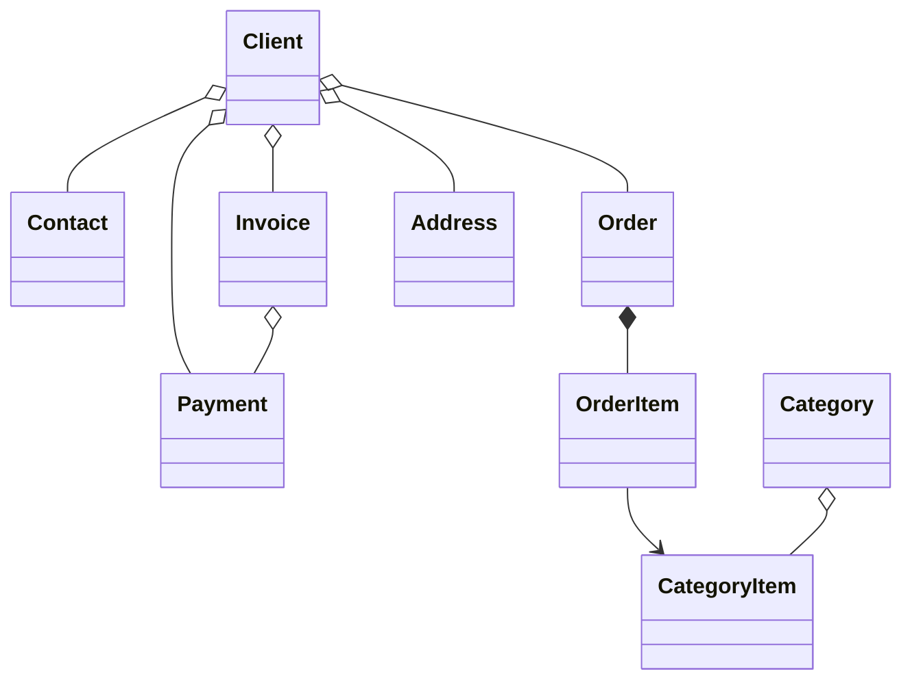

#  B2B CRM

Языки: [English](README.md) | [Русский](README_ru.md) | [Deutsch](README_de.md) | [Italiano](README_it.md) | [Español](README_es.md)

`B2B CRM` — корпоративное демонстрационное приложение на Jmix, показывающее, как разрабатывать **готовые к production** бизнес-системы
для работы с `клиентами`, `заказами`, `счетами`, `финансами` и `аналитикой`. <br>Оно отражает реальные сценарии **ERP/CRM** и демонстрирует
лучшие практики моделирования предметной области, UI, безопасности и реализации бизнес-логики.

## 📑 Содержание

- [Обзор](#-обзор)
- [Технический стек](#-технический-стек)
- [Используемые add-ons](#-используемые-add-ons)
- [Сборка и запуск](#-сборка-и-запуск)
- [AI-ассистент](#-ai-ассистент)
- [Демо-данные](#-демо-данные)
- [Учетные записи](#-учетные-записи-приложения)
- [Модель предметной области](#-модель-предметной-области)
- [Ролевая модель](#-ролевая-модель)

## 📖 Обзор

Проект моделирует типичный процесс B2B-продаж:

- Управление каталогом продуктов и категорий
- Ведение клиентов и контактов
- Отслеживание заказов и позиций заказов
- Выставление счетов и регистрация платежей
- Запрос бизнес-инсайтов у AI-ассистента
- Контроль задач и последних активностей
- Просмотр аналитики продаж

## 🛠️ Технический стек

- Java 21
- Jmix 2.8
- Spring Boot 3
- HSQLDB

## 🧩 Используемые Add-ons

- Audit
- Application settings
- Charts
- Data tools
- Dynamic attributes
- Grid export
- Local file storage
- Reports, включая шаблон счета

## 🚀 Сборка и запуск

Требования: Java 21+

### Запуск проекта

1. Запустите Jmix run configuration [B2B CRM](.run/crm-app.run.xml) или выполните команду

   ```bash
   ./gradlew bootRun
   ```

2. [Откройте URL приложения](http://localhost:8080/b2b-crm)

### Запуск через JAR

```bash
./gradlew bootJar -Pvaadin.productionMode
```

```bash
java -jar build/libs/crm.jar
```

### Запуск через Docker

```bash
docker build -t jmix-crm .
```

```bash
docker run --rm -p 8080:8080 jmix-crm
```

### Запуск через Docker Compose

```bash
docker-compose up
```

## 🤖 AI-ассистент

Приложение включает встроенное рабочее пространство `CRM AI` для анализа CRM-данных на естественном языке.

Основные возможности:

- Задавать бизнес-вопросы о клиентах, заказах, счетах, платежах и эффективности продаж
- Учитывать права доступа текущего пользователя к данным и хранить диалоги приватно для их автора
- Использовать встроенные бизнес-отчеты, такие как `Client 360 Report` и `Category Cashflow Risk Allocation Report`
- Сохранять историю диалогов с автоматически сгенерированными названиями чатов
- Загружать файлы в диалог и позволять ассистенту анализировать поддерживаемые документы и изображения
- Генерировать интерактивные ссылки на записи CRM прямо в ответах

Настройка:

- Укажите `spring.ai.openai.api-key` в [application.properties](src/main/resources/application.properties) или передайте переменную окружения `SPRING_AI_OPENAI_APIKEY`

После включения откройте пункт `CRM AI` в главном меню, чтобы начать новый диалог.

## 🎲 Демо-данные

Локальный профиль генерирует демо-данные при старте приложения:

- Генерацию демо-данных можно отключить свойством `crm.generateDemoData`
  в [application.properties](src/main/resources/application.properties)
- Каталог импортируется из [catalog.xlsx](src/main/resources/demo-data/catalog.xlsx)

## 👥 Учетные записи приложения

| Должность       | Имя пользователя | Пароль  | Доступ                                             |
|-----------------|------------------|---------|----------------------------------------------------|
| Administrator   | ```admin```      | admin   | Полный доступ ко всем данным и настройкам          |
| Supervisor      | ```james```      | james   | Manager + управление каталогом + назначение аккаунтов |
| Manager         | ```manager```    | manager | Полный доступ ко всем клиентам и заказам           |
| Account Manager | ```alice```      | alice   | Видит только клиентов, назначенных Alice Brown     |
| Account Manager | ```robert```     | robert  | Видит только клиентов, назначенных Robert Taylor   |

## ⚙️ Модель предметной области



## 🔐 Ролевая модель

Приложение использует иерархическую ролевую модель:

- `Administrator`: полный доступ ко всем функциям, сущностям и настройкам приложения.
- `Supervisor`: расширяет роль Manager дополнительными административными возможностями:
    - Управление каталогом продуктов, включая Categories и Category Items.
    - Назначение Account Managers клиентам.
- `Manager`: основная роль для операций продаж.
    - Полный доступ к Clients, Contacts, Orders, Invoices и Payments.
    - Доступ только на чтение к каталогу продуктов.
    - Управление собственными Tasks.
- `UI Minimal`: минимальный доступ, позволяющий входить в систему и выполнять базовую навигацию.
